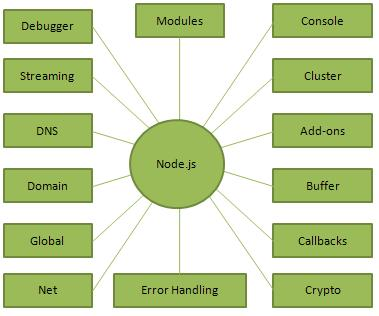

# Node.js
## What is Node.js?
`Node.js` is a `server-side platform built on Google Chrome's JavaScript Engine (V8 Engine).` Node.js was developed by Ryan Dahl in 2009 and its latest version is v0.10.36. The definition of Node.js as supplied by its official documentation is as follows −

`Node.js is a platform built on Chrome's JavaScript runtime for easily building fast and scalable network applications`. Node.js uses an `event-driven, non-blocking I/O model` that makes it lightweight and efficient, perfect for data-intensive real-time applications that run across distributed devices.
Node.js is an open source, cross-platform runtime environment for developing server-side and networking applications. Node.js applications are written in JavaScript, and can be run within the Node.js runtime on OS X, Microsoft Windows, and Linux.

Node.js also provides a rich library of various JavaScript modules which simplifies the development of web applications using Node.js to a great extent.
```
Node.js = Runtime Environment + JavaScript Library
```

## Features of Node.js

Following are some of the important features that make Node.js the first choice of software architects.

* `Asynchronous and Event Driven` − All APIs of Node.js library are asynchronous, that is, non-blocking. It essentially means a Node.js based server never waits for an API to return data. The server moves to the next API after calling it and a notification mechanism of Events of Node.js helps the server to get a response from the previous API call.

* `Very Fast` − Being built on Google Chrome's V8 JavaScript Engine, Node.js library is very fast in code execution.

* `Single Threaded but Highly Scalable` − Node.js uses a single threaded model with event looping. Event mechanism helps the server to respond in a non-blocking way and makes the server highly scalable as opposed to traditional servers which create limited threads to handle requests. Node.js uses a single threaded program and the same program can provide service to a much larger number of requests than traditional servers like Apache HTTP Server.

* `No Buffering − Node.js` applications never buffer any data. These applications simply output the data in chunks.

* `License − Node.js` is released under the MIT license.

## Who Uses Node.js?
Following is the link on github wiki containing an exhaustive list of projects, application and companies which are using Node.js. This list includes eBay, General Electric, GoDaddy, Microsoft, PayPal, Uber, Wikipins, Yahoo!, and Yammer to name a few.

[Projects, Applications, and Companies Using Node](https://github.com/somamukherjee2/node)

## Concepts
The following diagram depicts some important parts of Node.js which we will discuss in detail in the subsequent chapters.



## Where to Use Node.js?
Following are the areas where Node.js is proving itself as a perfect technology partner.


* I/O bound Applications
* Data Streaming Applications
* Data Intensive Real-time Applications (DIRT)
* JSON APIs based Applications
* Single Page Applications

## Where Not to Use Node.js?
It is not advisable to use Node.js for CPU intensive applications.
 
# Node.js Environment Setup
## Try it Option Online
You really do not need to set up your own environment to start learning `Node.js`. Reason is very simple, we already have set up Node.js environment online, so that you can execute all the available examples online and learn through practice. Feel free to modify any example and check the results with different options.

Try the following example using the [Live Demo](https://www.tutorialspoint.com/execute_nodejs_online.php) 


 ```
/* Hello World! program in Node.js */
console.log("Hello World!");
```

## Local Environment Setup
If you are still willing to set up your environment for Node.js, you need the following two softwares available on your computer, `(a) Text Editor and (b) The Node.js binary installables`.

### Text Editor
This will be used to type your program. Examples of few editors include `Windows Notepad, OS Edit command, Brief, Epsilon, EMACS, and vim or vi.` Name and version of text editor can vary on different operating systems. For example, Notepad will be used on Windows, and vim or vi can be used on windows as well as Linux or UNIX.

The files you create with your editor are called source files and contain program source code. The source files for Node.js programs are typically named with the extension ".js".

Before starting your programming, make sure you have one text editor in place and you have enough experience to write a computer program, save it in a file, and finally execute it.

### The Node.js Runtime
The source code written in source file is simply javascript. The Node.js interpreter will be used to interpret and execute your javascript code.

`Node.js distribution comes as a binary installable for SunOS , Linux, Mac OS X, and Windows operating systems with the 32-bit (386) and 64-bit (amd64) x86 processor architectures.`

Following section guides you on how to install Node.js binary distribution on various OS.

Download [Node.js archive](https://nodejs.org/en/)
Download latest version of Node.js installable archive file from Node.js Downloads. At the time of writing this tutorial, following are the versions available on different OS.

`OS`	`Archive name`
Windows	node-v6.3.1-x64.msi
Linux	node-v6.3.1-linux-x86.tar.gz
Mac	node-v6.3.1-darwin-x86.tar.gz
SunOS	node-v6.3.1-sunos-x86.tar.gz
Installation on UNIX/Linux/Mac OS X, and SunOS
Based on your OS architecture, download and extract the archive node-v6.3.1-osname.tar.gz into /tmp, and then finally move extracted files into /usr/local/nodejs directory. For example:
```
$ cd /tmp
$ wget http://nodejs.org/dist/v6.3.1/node-v6.3.1-linux-x64.tar.gz
$ tar xvfz node-v6.3.1-linux-x64.tar.gz
$ mkdir -p /usr/local/nodejs
$ mv node-v6.3.1-linux-x64/* /usr/local/nodejs
Add /usr/local/nodejs/bin to the PATH environment variable.
```

OS	Output
```
Linux	export PATH=$PATH:/usr/local/nodejs/bin
Mac	export PATH=$PATH:/usr/local/nodejs/bin
FreeBSD	export PATH=$PATH:/usr/local/nodejs/bin
Installation on Windows
Use the MSI file and follow the prompts to install the Node.js. By default, the installer uses the Node.js distribution in C:\Program Files\nodejs. The installer should set the C:\Program Files\nodejs\bin directory in window's PATH environment variable. Restart any open command prompts for the change to take effect.
```

Verify installation: Executing a File
Create a js file named main.js on your machine (Windows or Linux) having the following code.

 
/* Hello, World! program in node.js */
```
console.log("Hello, World!")
```
Now execute main.js file using Node.js interpreter to see the result −
```
$ node main.js
```
If everything is fine with your installation, this should produce the following result −
```
Hello, World!
```
# First Application
Before creating an actual `"Hello, World!"` application using Node.js, let us see the components of a Node.js application. A Node.js application consists of the following three important components −

`Import required modules` − We use the require directive to load Node.js modules.

`Create server` − A server which will listen to client's requests similar to Apache HTTP Server.

`Read request and return response` − The server created in an earlier step will read the HTTP request made by the client which can be a browser or a console and return the response.

## Creating Node.js Application
`Step 1 - Import Required Module`
We use the require directive to load the http module and store the returned HTTP instance into an http variable as follows −
```
var http = require("http");
```
`Step 2 - Create Server`
We use the created http instance and call http.createServer() method to create a server instance and then we bind it at port 8081 using the listen method associated with the server instance. Pass it a function with parameters request and response. Write the sample implementation to always return "Hello World".
```
http.createServer(function (request, response) {
   // Send the HTTP header 
   // HTTP Status: 200 : OK
   // Content Type: text/plain
   response.writeHead(200, {'Content-Type': 'text/plain'});
   
   // Send the response body as "Hello World"
   response.end('Hello World\n');
}).listen(8081);
```
// Console will print the message
```
console.log('Server running at http://127.0.0.1:8081/');
```
The above code is enough to create an HTTP server which listens, i.e., waits for a request over 8081 port on the local machine.

`Step 3 - Testing Request & Response`
Let's put `step 1 and 2` together in a file called `main.js` and start our HTTP server as shown below −
```
var http = require("http");

http.createServer(function (request, response) {
   // Send the HTTP header 
   // HTTP Status: 200 : OK
   // Content Type: text/plain
   response.writeHead(200, {'Content-Type': 'text/plain'});
   
   // Send the response body as "Hello World"
   response.end('Hello World\n');
}).listen(8081);

// Console will print the message
console.log('Server running at http://127.0.0.1:8081/');
```
Now execute the main.js to start the server as follows −
```
$ node main.js
```
Verify the Output. Server has started.

Server running at http://127.0.0.1:8081/
Make a Request to the Node.js Server
Open http://127.0.0.1:8081/ in any browser and observe the following result.

You have your first HTTP server up and running which is responding to all the HTTP requests at port 8081.
# REPL Terminal
REPL stands for `Read Eval Print Loop` and it represents a computer environment like a Windows console or Unix/Linux shell where a command is entered and the system responds with an output in an interactive mode. Node.js or Node comes bundled with a `REPL` environment. It performs the following tasks −

`Read` − Reads user's input, parses the input into JavaScript data-structure, and stores in memory.
`Eval` − Takes and evaluates the data structure.
`Print` − Prints the result.
`Loop` − Loops the above command until the user presses ctrl-c twice.

The `REPL` feature of Node is very useful in experimenting with Node.js codes and to debug JavaScript codes.

## Online REPL Terminal
To simplify your learning, we have set up an easy to use Node.js REPL environment online, where you can practice Node.js syntax − Launch Node.js REPL Terminal 

## Starting REPL
REPL can be started by simply running node on shell/console without any arguments as follows.
```
$ node
```
You will see the `REPL Command prompt >` where you can type any Node.js command −
```
$ node
>
Simple Expression
Let's try a simple mathematics at the Node.js REPL command prompt −

$ node
> 1 + 3
4
> 1 + ( 2 * 3 ) - 4
3
>
```
Use Variables
You can make use variables to store values and print later like any conventional script. If var keyword is not used, then the value is stored in the variable and printed. Whereas if var keyword is used, then the value is stored but not printed. You can print variables using console.log().
```
$ node
> x = 10
10
> var y = 10
undefined
> x + y
20
> console.log("Hello World")
Hello World
```
undefined
Multiline Expression
Node REPL supports multiline expression similar to JavaScript. Let's check the following do-while loop in action −
```
$ node
> var x = 0
undefined
> do {
... x++;
... console.log("x: " + x);
... }
while ( x < 5 );
x: 1
x: 2
x: 3
x: 4
x: 5
undefined
>
```
... comes automatically when you press Enter after the opening bracket. Node automatically checks the continuity of expressions.

Underscore Variable
You can use underscore (_) to get the last result −
```
$ node
> var x = 10
undefined
> var y = 20
undefined
> x + y
30
> var sum = _
undefined
> console.log(sum)
30
undefined
>
```
## REPL Commands
* ctrl + c − terminate the current command.
* ctrl + c twice − terminate the Node REPL.
* ctrl + d − terminate the Node REPL.

`Up/Down Keys` − see command history and modify previous commands.
`tab Keys` − list of current commands.

* .help − list of all commands.

* .break − exit from multiline expression.

* .clear − exit from multiline expression.

* .save filename − save the current Node REPL session to a file.

* .load filename − load file content in current Node REPL session.

## Stopping REPL
As mentioned above, you will need to use ctrl-c twice to come out of Node.js REPL.
```
$ node
>
(^C again to quit)
>
```
# Node.js - NPM

`Node Package Manager (NPM)` provides two main functionalities −

* Online repositories for node.js packages/modules which are searchable on search.nodejs.org
* Command line utility to install `Node.js` packages, do version management and dependency management of Node.js packages.

`NPM` comes bundled with Node.js installables after v0.6.3 version. To verify the same, open console and type the following command and see the result −
```
$ npm --version
```
2.7.1
If you are running an old version of NPM then it is quite easy to update it to the latest version. Just use the following command from root −
```
$ sudo npm install npm -g 
/usr/bin/npm -> /usr/lib/node_modules/npm/bin/npm-cli.js
npm@2.7.1 /usr/lib/node_modules/npm
```
Installing Modules using NPM
There is a simple syntax to install any Node.js module −
```
$ npm install <Module Name>
```
For example, following is the command to install a famous Node.js web framework module called express −
```
$ npm install express
```
Now you can use this module in your js file as following −
```
var express = require('express');
```
## Global vs Local Installation
By default, NPM installs any dependency in the local mode. Here local mode refers to the package installation in node_modules directory lying in the folder where Node application is present. Locally deployed packages are accessible via require() method. For example, when we installed express module, it created node_modules directory in the current directory where it installed the express module.

```
$ ls -l
total 0
drwxr-xr-x 3 root root 20 Mar 17 02:23 node_modules
```
Alternatively, you can use `npm ls` command to list down all the locally installed modules.

Globally installed packages/dependencies are stored in system directory. Such dependencies can be used in CLI (Command Line Interface) function of any node.js but cannot be imported using require() in Node application directly. Now let's try installing the express module using global installation.
```
$ npm install express -g
```
This will produce a similar result but the module will be installed globally. Here, the first line shows the module version and the location where it is getting installed.
```
express@4.12.2 /usr/lib/node_modules/express
├── merge-descriptors@1.0.0
├── utils-merge@1.0.0
├── cookie-signature@1.0.6
├── methods@1.1.1
├── fresh@0.2.4
├── cookie@0.1.2
├── escape-html@1.0.1
├── range-parser@1.0.2
├── content-type@1.0.1
├── finalhandler@0.3.3
├── vary@1.0.0
├── parseurl@1.3.0
├── content-disposition@0.5.0
├── path-to-regexp@0.1.3
├── depd@1.0.0
├── qs@2.3.3
├── on-finished@2.2.0 (ee-first@1.1.0)
├── etag@1.5.1 (crc@3.2.1)
├── debug@2.1.3 (ms@0.7.0)
├── proxy-addr@1.0.7 (forwarded@0.1.0, ipaddr.js@0.1.9)
├── send@0.12.1 (destroy@1.0.3, ms@0.7.0, mime@1.3.4)
├── serve-static@1.9.2 (send@0.12.2)
├── accepts@1.2.5 (negotiator@0.5.1, mime-types@2.0.10)
└── type-is@1.6.1 (media-typer@0.3.0, mime-types@2.0.10)
```
You can use the following command to check all the modules installed globally −
```
$ npm ls -g
```
## Using package.json
`package.json` is present in the root directory of any Node application/module and is used to define the properties of a package. Let's open package.json of express package present in node_modules/express/
```
{
   "name": "express",
      "description": "Fast, unopinionated, minimalist web framework",
      "version": "4.11.2",
      "author": {
      
         "name": "TJ Holowaychuk",
         "email": "tj@vision-media.ca"
      },
   
   "contributors": [{
      "name": "Aaron Heckmann",
      "email": "aaron.heckmann+github@gmail.com"
   }, 
   
   {
      "name": "Ciaran Jessup",
      "email": "ciaranj@gmail.com"
   },
   
   {
      "name": "Douglas Christopher Wilson",
      "email": "doug@somethingdoug.com"
   },
   
   {
      "name": "Guillermo Rauch",
      "email": "rauchg@gmail.com"
   },
   
   {
      "name": "Jonathan Ong",
      "email": "me@jongleberry.com"
   },
   
   {
      "name": "Roman Shtylman",
      "email": "shtylman+expressjs@gmail.com"
   },
   
   {
      "name": "Young Jae Sim",
      "email": "hanul@hanul.me"
   } ],
   
   "license": "MIT", "repository": {
      "type": "git",
      "url": "https://github.com/strongloop/express"
   },
   
   "homepage": "https://expressjs.com/", "keywords": [
      "express",
      "framework",
      "sinatra",
      "web",
      "rest",
      "restful",
      "router",
      "app",
      "api"
   ],
   
   "dependencies": {
      "accepts": "~1.2.3",
      "content-disposition": "0.5.0",
      "cookie-signature": "1.0.5",
      "debug": "~2.1.1",
      "depd": "~1.0.0",
      "escape-html": "1.0.1",
      "etag": "~1.5.1",
      "finalhandler": "0.3.3",
      "fresh": "0.2.4",
      "media-typer": "0.3.0",
      "methods": "~1.1.1",
      "on-finished": "~2.2.0",
      "parseurl": "~1.3.0",
      "path-to-regexp": "0.1.3",
      "proxy-addr": "~1.0.6",
      "qs": "2.3.3",
      "range-parser": "~1.0.2",
      "send": "0.11.1",
      "serve-static": "~1.8.1",
      "type-is": "~1.5.6",
      "vary": "~1.0.0",
      "cookie": "0.1.2",
      "merge-descriptors": "0.0.2",
      "utils-merge": "1.0.0"
   },
   
   "devDependencies": {
      "after": "0.8.1",
      "ejs": "2.1.4",
      "istanbul": "0.3.5",
      "marked": "0.3.3",
      "mocha": "~2.1.0",
      "should": "~4.6.2",
      "supertest": "~0.15.0",
      "hjs": "~0.0.6",
      "body-parser": "~1.11.0",
      "connect-redis": "~2.2.0",
      "cookie-parser": "~1.3.3",
      "express-session": "~1.10.2",
      "jade": "~1.9.1",
      "method-override": "~2.3.1",
      "morgan": "~1.5.1",
      "multiparty": "~4.1.1",
      "vhost": "~3.0.0"
   },
   
   "engines": {
      "node": ">= 0.10.0"
   },
   
   "files": [
      "LICENSE",
      "History.md",
      "Readme.md",
      "index.js",
      "lib/"
   ],
   
   "scripts": {
      "test": "mocha --require test/support/env 
         --reporter spec --bail --check-leaks test/ test/acceptance/",
      "test-cov": "istanbul cover node_modules/mocha/bin/_mocha 
         -- --require test/support/env --reporter dot --check-leaks test/ test/acceptance/",
      "test-tap": "mocha --require test/support/env 
         --reporter tap --check-leaks test/ test/acceptance/",
      "test-travis": "istanbul cover node_modules/mocha/bin/_mocha 
         --report lcovonly -- --require test/support/env 
         --reporter spec --check-leaks test/ test/acceptance/"
   },
   
   "gitHead": "63ab25579bda70b4927a179b580a9c580b6c7ada",
   "bugs": {
      "url": "https://github.com/strongloop/express/issues"
   },
   
   "_id": "express@4.11.2",
   "_shasum": "8df3d5a9ac848585f00a0777601823faecd3b148",
   "_from": "express@*",
   "_npmVersion": "1.4.28",
   "_npmUser": {
      "name": "dougwilson",
      "email": "doug@somethingdoug.com"
   },
   
   "maintainers": [{
      "name": "tjholowaychuk",
      "email": "tj@vision-media.ca"
   },
   
   {
      "name": "jongleberry",
      "email": "jonathanrichardong@gmail.com"
   },
   
   {
      "name": "shtylman",
      "email": "shtylman@gmail.com"
   },
   
   {
      "name": "dougwilson",
      "email": "doug@somethingdoug.com"
   },
   
   {
      "name": "aredridel",
      "email": "aredridel@nbtsc.org"
   },
   
   {
      "name": "strongloop",
      "email": "callback@strongloop.com"
   },
   
   {
      "name": "rfeng",
      "email": "enjoyjava@gmail.com"
   }],
   
   "dist": {
      "shasum": "8df3d5a9ac848585f00a0777601823faecd3b148",
      "tarball": "https://registry.npmjs.org/express/-/express-4.11.2.tgz"
   },
   
   "directories": {},
      "_resolved": "https://registry.npmjs.org/express/-/express-4.11.2.tgz",
      "readme": "ERROR: No README data found!"
}
```
Attributes of Package.json
name − name of the package

version − version of the package

description − description of the package

homepage − homepage of the package

author − author of the package

contributors − name of the contributors to the package

dependencies − list of dependencies. NPM automatically installs all the dependencies mentioned here in the node_module folder of the package.

repository − repository type and URL of the package

main − entry point of the package

keywords − keywords

## Uninstalling a Module
Use the following command to uninstall a Node.js module.
```
$ npm uninstall express
```
Once NPM uninstalls the package, you can verify it by looking at the content of `/node_modules/ directory` or type the following command −
```
$ npm ls
```
## Updating a Module
Update package.json and change the version of the dependency to be updated and run the following command.
```
$ npm update express
```
## Search a Module
Search a package name using NPM.
```
$ npm search express
```
## Create a Module
Creating a module requires `package.json` to be generated. Let's generate package.json using NPM, which will generate the basic skeleton of the package.json.
```
$ npm init
```
This utility will walk you through creating a package.json file.
It only covers the most common items, and tries to guess sane defaults.

See `'npm help json'` for definitive documentation on these fields
and exactly what they do.

Use `'npm install <pkg> --save'` afterwards to install a package and
save it as a dependency in the package.json file.

Press `^C `at any time to quit.
name: (webmaster)
You will need to provide all the required information about your module. You can take help from the above-mentioned package.json file to understand the meanings of various information demanded.
Once package.json is generated, use the following command to register yourself with NPM repository site using a valid email address.
```
$ npm adduser
Username: mcmohd
Password:
Email: (this IS public) mcmohd@gmail.com
```
It is time now to `publish` your module −
```
$ npm publish
```
If everything is fine with your module, then it will be published in the repository and will be accessible to install using NPM like any other Node.js module.

## Callback Concepts

### What is Callback?
`Callback` is an asynchronous equivalent for a function. A callback function is called at the completion of a given task. Node makes heavy use of callbacks. All the APIs of Node are written in such a way that they support callbacks.

For example, a function to read a file may start reading file and return the control to the execution environment immediately so that the next instruction can be executed. Once file I/O is complete, it will call the callback function while passing the callback function, the content of the file as a parameter. So there is no blocking or wait for File I/O. This makes Node.js highly scalable, as it can process a high number of requests without waiting for any function to return results.

## Blocking Code Example
Create a text file named `input.txt` with the following content −
```
Tutorials Point is giving self learning content
to teach the world in simple and easy way!!!!!
```
Create a js file named `main.js` with the following code −
```
var fs = require("fs");
var data = fs.readFileSync('input.txt');
console.log(data.toString());
console.log("Program Ended");
```
Now run the `main.js` to see the result −
```
$ node main.js
```
Verify the Output.
```
Tutorials Point is giving self learning content
to teach the world in simple and easy way!!!!!
Program Ended
```
## Non-Blocking Code Example
Create a text file named `input.txt` with the following content.
```
Tutorials Point is giving self learning content
to teach the world in simple and easy way!!!!!
```
Update `main.js` to have the following code −
```
var fs = require("fs");

fs.readFile('input.txt', function (err, data) {
   if (err) return console.error(err);
   console.log(data.toString());
});

console.log("Program Ended");
```
Now run the main.js to see the result −
```
$ node main.js
```
Verify the Output.
```
Program Ended
Tutorials Point is giving self learning content
to teach the world in simple and easy way!!!!!
```
These two examples explain the concept of blocking and non-blocking calls.

The first example shows that the program blocks until it reads the file and then only it proceeds to end the program.

The second example shows that the program does not wait for file reading and proceeds to print "Program Ended" and at the same time, the program without blocking continues reading the file.

Thus, a blocking program executes very much in sequence. From the programming point of view, it is easier to implement the logic but non-blocking programs do not execute in sequence. In case a program needs to use any data to be processed, it should be kept within the same block to make it sequential execution.

# Node.js Event Loop

`Node.js` is a single-threaded application, but it can support concurrency via the concept of `event and callbacks.` Every API of `Node.js` is asynchronous and being single-threaded, they use async function calls to maintain concurrency. Node uses `observer pattern`. Node thread keeps an event loop and whenever a task gets completed, it fires the corresponding event which signals the `event-listener` function to execute.

## Event-Driven Programming
`Node.js` uses events heavily and it is also one of the reasons why `Node.js` is pretty fast compared to other similar technologies. As soon as Node starts its server, it simply initiates its variables, declares functions and then simply waits for the event to occur.

In an event-driven application, there is generally a main loop that listens for events, and then triggers a callback function when one of those events is detected.

## Event Loop
Although events look quite similar to callbacks, the difference lies in the fact that callback functions are called when an asynchronous function returns its result, whereas event handling works on the observer pattern. The functions that listen to events act as Observers. Whenever an event gets fired, its listener function starts executing. Node.js has multiple in-built events available through events module and EventEmitter class which are used to bind events and event-listeners as follows −
```
// Import events module
var events = require('events');

// Create an eventEmitter object
var eventEmitter = new events.EventEmitter();
Following is the syntax to bind an event handler with an event −

// Bind event and event handler as follows
eventEmitter.on('eventName', eventHandler);
We can fire an event programmatically as follows −

// Fire an event
eventEmitter.emit('eventName');
```
Example
Create a js file named main.js with the following code −


```
// Import events module
var events = require('events');

// Create an eventEmitter object
var eventEmitter = new events.EventEmitter();

// Create an event handler as follows
var connectHandler = function connected() {
   console.log('connection succesful.');
  
   // Fire the data_received event 
   eventEmitter.emit('data_received');
}

// Bind the connection event with the handler
eventEmitter.on('connection', connectHandler);
 
// Bind the data_received event with the anonymous function
eventEmitter.on('data_received', function() {
   console.log('data received succesfully.');
});

// Fire the connection event 
eventEmitter.emit('connection');

console.log("Program Ended.");
```
Now let's try to run the above program and check its output −
```
$ node main.js
```
IT should produce the following result −

connection successful.
data received successfully.
Program Ended.

## How Node Applications Work?
In `Node Application`, any async function accepts a callback as the last parameter and a callback function accepts an error as the first parameter. Let's revisit the previous example again. Create a text file named input.txt with the following content.

Tutorials Point is giving self learning content
to teach the world in simple and easy way!!!!!
Create a js file named `main.js` having the following code −
```
var fs = require("fs");

fs.readFile('input.txt', function (err, data) {
   if (err) {
      console.log(err.stack);
      return;
   }
   console.log(data.toString());
});
console.log("Program Ended");
```
Here `fs.readFile()` is a async function whose purpose is to read a file. If an error occurs during the read operation, then the err object will contain the corresponding error, else data will contain the contents of the file. readFile passes err and data to the callback function after the read operation is complete, which finally prints the content.
```
Program Ended
Tutorials Point is giving self learning content
to teach the world in simple and easy way!!!!!
```
# Node.js - Event Emitter
Many objects in a Node emit events, for example, a net.Server emits an event each time a peer connects to it, an fs.readStream emits an event when the file is opened. All objects which emit events are the instances of events.EventEmitter.

## EventEmitter Class
As we have seen in the previous section, EventEmitter class lies in the events module. It is accessible via the following code −
```
// Import events module
var events = require('events');
```

// Create an eventEmitter object
```
var eventEmitter = new events.EventEmitter();
```
When an EventEmitter instance faces any error, it emits an 'error' event. When a new listener is added, 'newListener' event is fired and when a listener is removed, 'removeListener' event is fired.

`EventEmitter` provides multiple properties like on and emit. on property is used to bind a function with the event and emit is used to fire an event.

Methods
### Sr.No.	Method & Description
`1       addListener(event, listener)`

Adds a listener at the end of the listeners array for the specified event. No checks are made to see if the listener has already been added. Multiple calls passing the same combination of event and listener will result in the listener being added multiple times. Returns emitter, so calls can be chained.

`2	   on(event, listener)`

Adds a listener at the end of the listeners array for the specified event. No checks are made to see if the listener has already been added. Multiple calls passing the same combination of event and listener will result in the listener being added multiple times. Returns emitter, so calls can be chained.

`3	once(event, listener)`

Adds a one time listener to the event. This listener is invoked only the next time the event is fired, after which it is removed. Returns emitter, so calls can be chained.

`4   removeListener(event, listener)`

Removes a listener from the listener array for the specified event. Caution − It changes the array indices in the listener array behind the listener. removeListener will remove, at most, one instance of a listener from the listener array. If any single listener has been added multiple times to the listener array for the specified event, then removeListener must be called multiple times to remove each instance. Returns emitter, so calls can be chained.

`5	removeAllListeners([event])`

Removes all listeners, or those of the specified event. It's not a good idea to remove listeners that were added elsewhere in the code, especially when it's on an emitter that you didn't create (e.g. sockets or file streams). Returns emitter, so calls can be chained.

`6	setMaxListeners(n)`

By default, EventEmitters will print a warning if more than 10 listeners are added for a particular event. This is a useful default which helps finding memory leaks. Obviously not all Emitters should be limited to 10. This function allows that to be increased. Set to zero for unlimited.

`7	
listeners(event)`

Returns an array of listeners for the specified event.

`8	
emit(event, [arg1], [arg2], [...])`

Execute each of the listeners in order with the supplied arguments. Returns true if the event had listeners, false otherwise.

## Class Methods
`Sr.No.	Method & Description`
`1	listenerCount(emitter, event)`

Returns the number of listeners for a given event.

## Events
### Sr.No.	Events & Description
`1
newListener`

event − String: the event name

listener − Function: the event handler function

This event is emitted any time a listener is added. When this event is triggered, the listener may not yet have been added to the array of listeners for the event.

`2	
removeListener`

event − String The event name

listener − Function The event handler function

This event is emitted any time someone removes a listener. When this event is triggered, the listener may not yet have been removed from the array of listeners for the event.

Example
Create a js file named `main.js` with the following Node.js code −

```
var events = require('events');
var eventEmitter = new events.EventEmitter();

// listener #1
var listner1 = function listner1() {
   console.log('listner1 executed.');
}

// listener #2
var listner2 = function listner2() {
   console.log('listner2 executed.');
}

// Bind the connection event with the listner1 function
eventEmitter.addListener('connection', listner1);

// Bind the connection event with the listner2 function
eventEmitter.on('connection', listner2);

var eventListeners = require('events').EventEmitter.listenerCount
   (eventEmitter,'connection');
console.log(eventListeners + " Listner(s) listening to connection event");

// Fire the connection event 
eventEmitter.emit('connection');

// Remove the binding of listner1 function
eventEmitter.removeListener('connection', listner1);
console.log("Listner1 will not listen now.");

// Fire the connection event 
eventEmitter.emit('connection');

eventListeners = require('events').EventEmitter.listenerCount(eventEmitter,'connection');
console.log(eventListeners + " Listner(s) listening to connection event");

console.log("Program Ended.");
```
Now run the main.js to see the result −
```
$ node main.js
```
Verify the Output.
```
2 Listner(s) listening to connection event
listner1 executed.
listner2 executed.
Listner1 will not listen now.
listner2 executed.
1 Listner(s) listening to connection event
Program Ended.
```
# Node.js Buffers
Pure JavaScript is Unicode friendly, but it is not so for binary data. While dealing with TCP streams or the file system, it's necessary to handle octet streams. Node provides Buffer class which provides instances to store raw data similar to an array of integers but corresponds to a raw memory allocation outside the V8 heap.

Buffer class is a global class that can be accessed in an application without importing the buffer module.

Creating Buffers
Node Buffer can be constructed in a variety of ways.

`Method 1`
Following is the syntax to create an uninitiated Buffer of 10 octets −
```
var buf = new Buffer(10);
```
`Method 2`
Following is the syntax to create a Buffer from a given array −
```
var buf = new Buffer([10, 20, 30, 40, 50]);
```
`Method 3`
Following is the syntax to create a Buffer from a given string and optionally encoding type −
```
var buf = new Buffer("Simply Easy Learning", "utf-8");
```
Though "utf8" is the default encoding, you can use any of the following encodings "ascii", "utf8", "utf16le", "ucs2", "base64" or "hex".

## Writing to Buffers
Syntax
Following is the syntax of the method to write into a Node Buffer −

buf.write(string[, offset][, length][, encoding])
Parameters
Here is the description of the parameters used −

string − This is the string data to be written to buffer.

offset − This is the index of the buffer to start writing at. Default value is 0.

length − This is the number of bytes to write. Defaults to buffer.length.

encoding − Encoding to use. 'utf8' is the default encoding.

Return Value
This method returns the number of octets written. If there is not enough space in the buffer to fit the entire string, it will write a part of the string.

Example
 Live Demo
buf = new Buffer(256);
len = buf.write("Simply Easy Learning");

console.log("Octets written : "+  len);
When the above program is executed, it produces the following result −

Octets written : 20
Reading from Buffers
Syntax
Following is the syntax of the method to read data from a Node Buffer −

buf.toString([encoding][, start][, end])
Parameters
Here is the description of the parameters used −

encoding − Encoding to use. 'utf8' is the default encoding.

start − Beginning index to start reading, defaults to 0.

end − End index to end reading, defaults is complete buffer.

Return Value
This method decodes and returns a string from buffer data encoded using the specified character set encoding.

Example
 Live Demo
buf = new Buffer(26);
for (var i = 0 ; i < 26 ; i++) {
  buf[i] = i + 97;
}

console.log( buf.toString('ascii'));       // outputs: abcdefghijklmnopqrstuvwxyz
console.log( buf.toString('ascii',0,5));   // outputs: abcde
console.log( buf.toString('utf8',0,5));    // outputs: abcde
console.log( buf.toString(undefined,0,5)); // encoding defaults to 'utf8', outputs abcde
When the above program is executed, it produces the following result −

abcdefghijklmnopqrstuvwxyz
abcde
abcde
abcde
Convert Buffer to JSON
Syntax
Following is the syntax of the method to convert a Node Buffer into JSON object −

buf.toJSON()
Return Value
This method returns a JSON-representation of the Buffer instance.

Example
 Live Demo
var buf = new Buffer('Simply Easy Learning');
var json = buf.toJSON(buf);

console.log(json);
When the above program is executed, it produces the following result −

{ type: 'Buffer',
data:
[
83,
105,
109,
112,
108,
121,
32,
69,
97,
115,
121,
32,
76,
101,
97,
114,
110,
105,
110,
103
]
}
Concatenate Buffers
Syntax
Following is the syntax of the method to concatenate Node buffers to a single Node Buffer −

Buffer.concat(list[, totalLength])
Parameters
Here is the description of the parameters used −

list − Array List of Buffer objects to be concatenated.

totalLength − This is the total length of the buffers when concatenated.

Return Value
This method returns a Buffer instance.

Example
 Live Demo
var buffer1 = new Buffer('TutorialsPoint ');
var buffer2 = new Buffer('Simply Easy Learning');
var buffer3 = Buffer.concat([buffer1,buffer2]);

console.log("buffer3 content: " + buffer3.toString());
When the above program is executed, it produces the following result −

buffer3 content: TutorialsPoint Simply Easy Learning
Compare Buffers
Syntax
Following is the syntax of the method to compare two Node buffers −

buf.compare(otherBuffer);
Parameters
Here is the description of the parameters used −

otherBuffer − This is the other buffer which will be compared with buf

Return Value
Returns a number indicating whether it comes before or after or is the same as the otherBuffer in sort order.

Example
 Live Demo
var buffer1 = new Buffer('ABC');
var buffer2 = new Buffer('ABCD');
var result = buffer1.compare(buffer2);

if(result < 0) {
   console.log(buffer1 +" comes before " + buffer2);
} else if(result === 0) {
   console.log(buffer1 +" is same as " + buffer2);
} else {
   console.log(buffer1 +" comes after " + buffer2);
}
When the above program is executed, it produces the following result −

ABC comes before ABCD
Copy Buffer
Syntax
Following is the syntax of the method to copy a node buffer −

buf.copy(targetBuffer[, targetStart][, sourceStart][, sourceEnd])
Parameters
Here is the description of the parameters used −

targetBuffer − Buffer object where buffer will be copied.

targetStart − Number, Optional, Default: 0

sourceStart − Number, Optional, Default: 0

sourceEnd − Number, Optional, Default: buffer.length

Return Value
No return value. Copies data from a region of this buffer to a region in the target buffer even if the target memory region overlaps with the source. If undefined, the targetStart and sourceStart parameters default to 0, while sourceEnd defaults to buffer.length.

Example
 Live Demo
var buffer1 = new Buffer('ABC');

//copy a buffer
var buffer2 = new Buffer(3);
buffer1.copy(buffer2);
console.log("buffer2 content: " + buffer2.toString());
When the above program is executed, it produces the following result −

buffer2 content: ABC
Slice Buffer
Syntax
Following is the syntax of the method to get a sub-buffer of a node buffer −

buf.slice([start][, end])
Parameters
Here is the description of the parameters used −

start − Number, Optional, Default: 0

end − Number, Optional, Default: buffer.length

Return Value
Returns a new buffer which references the same memory as the old one, but offset and cropped by the start (defaults to 0) and end (defaults to buffer.length) indexes. Negative indexes start from the end of the buffer.

Example
 Live Demo
var buffer1 = new Buffer('TutorialsPoint');

//slicing a buffer
var buffer2 = buffer1.slice(0,9);
console.log("buffer2 content: " + buffer2.toString());
When the above program is executed, it produces the following result −

buffer2 content: Tutorials
Buffer Length
Syntax
Following is the syntax of the method to get a size of a node buffer in bytes −

buf.length;
Return Value
Returns the size of a buffer in bytes.

Example
 Live Demo
var buffer = new Buffer('TutorialsPoint');

//length of the buffer
console.log("buffer length: " + buffer.length);
When the above program is executed, it produces following result −

buffer length: 14
Methods Reference
Following is a reference of Buffers module available in Node.js. For more detail, you can refer to the official documentation.
Class Methods
Sr.No.	Method & Description
1	
Buffer.isEncoding(encoding)

Returns true if the encoding is a valid encoding argument, false otherwise.

2	
Buffer.isBuffer(obj)

Tests if obj is a Buffer.

3	
Buffer.byteLength(string[, encoding])

Gives the actual byte length of a string. encoding defaults to 'utf8'. It is not the same as String.prototype.length, since String.prototype.length returns the number of characters in a string.

4	
Buffer.concat(list[, totalLength])

Returns a buffer which is the result of concatenating all the buffers in the list together.

5	
Buffer.compare(buf1, buf2)

The same as buf1.compare(buf2). Useful for sorting an array of buffers.

